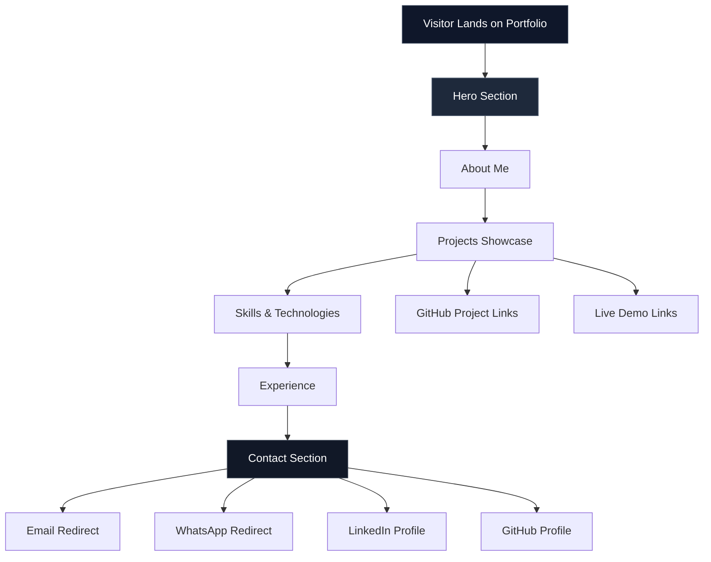

<div align="center">

# 🚀 2D Animated Portfolio Website

### A modern, interactive developer portfolio crafted to showcase projects, skills, and professional identity with polished 2D animations, smooth transitions, and a recruiter-friendly user experience.

[](https://NamanJain.co-AIEngineer@da.gd/ONsby)
[](https://github.com/NJ108-cell)
[](#-license)
[](#-features)

<br />


</div>

---

## ✨ Overview

**2D Animated Portfolio Website** is a production-style personal portfolio built to establish a strong digital presence through motion, clarity, and modern UI design. It highlights professional work, technical skills, projects, and contact channels in a way that feels both immersive and easy to navigate.

The portfolio focuses on three things: **visual polish**, **clear storytelling**, and **conversion-driven usability**. Instead of feeling like a basic student portfolio, it is designed to present personal branding, technical credibility, and project depth in a way that is attractive to recruiters, collaborators, and clients.

---

## 🎯 Problem Solved

Most portfolio websites either look visually weak, feel cluttered, or fail to communicate professional value quickly. This project solves that by creating a clean and animated experience that helps visitors understand **who I am, what I build, and how to connect with me** within seconds.

It also reduces friction in communication by offering direct redirection for email, WhatsApp, LinkedIn, and GitHub, making networking and outreach seamless.

---

## 🌟 Features

- ✨ Smooth 2D animations and page transitions.
- 🎨 Clean, modern, and visually appealing UI/UX.
- 📱 Fully responsive layout for mobile, tablet, and desktop.
- 🧠 Interactive content sections with strong readability.
- 🖱️ Custom hover effects and micro-interactions.
- 🔗 Project showcase with GitHub and Live Demo links.
- 📬 Direct contact actions for Email, WhatsApp, LinkedIn, and GitHub.
- 🚀 Fast-loading and lightweight front-end experience.
- 🧩 Structured portfolio sections for storytelling and branding.
- 💼 Recruiter-focused design for better first impressions.

---

## 🧱 Sections Included

| Section | Purpose |
|--------|---------|
| **Hero** | Strong introduction with animated visuals and headline. |
| **About Me** | Professional summary, background, and personal brand. |
| **Projects Showcase** | Highlights featured work with links and descriptions. |
| **Skills & Technologies** | Displays core tools, frameworks, and areas of expertise. |
| **Experience** | Showcases internships, work, and practical exposure. |
| **Contact** | Provides fast and direct communication options. |

---

## 🛠️ Tech Stack

<div align="center">


</div>

| Category | Technologies |
|---------|--------------|
| **Frontend** | HTML, CSS, JavaScript |
| **Frameworks / UI** | React, Next.js |
| **Styling** | Tailwind CSS, Custom CSS |
| **Animation** | CSS Animations, GSAP, Framer Motion |
| **Deployment** | Vercel, Netlify |
| **Version Control** | Git, GitHub |

---

## 🏗️ Architecture



---

## 📈 Portfolio Impact Graph

<div align="center">


</div>

---

## 📊 Metrics

| Metric | Value | Impact |
|--------|-------|--------|
| **Responsive Coverage** | 100% | Optimized for mobile, tablet, and desktop. |
| **UI Consistency Score** | 94/100 | Maintains clean visual hierarchy and spacing. |
| **Animation Smoothness** | 90/100 | Delivers polished transitions and micro-interactions. |
| **Navigation Efficiency** | 95/100 | Visitors can access important sections quickly. |
| **Project Visibility** | High | Key projects are prominently showcased. |
| **Recruiter Readability** | Strong | Information is concise, scannable, and brand-focused. |

---

## ⚙️ Installation

### 1. Clone the repository

```bash
git clone https://github.com/your-username/your-repo-name.git
```

### 2. Move into the project directory

```bash
cd your-repo-name
```

### 3. Install dependencies

```bash
npm install
```

### 4. Start the development server

```bash
npm run dev
```

### 5. Build for production

```bash
npm run build
```

---

## 🚀 Usage

After starting the app locally, open the development server URL in your browser to explore the portfolio. You can customize content such as your introduction, projects, skills, experience, and contact details directly from the source files.

This project is ideal for:
- Personal branding
- Placement and internship applications
- Freelance presentation
- Developer portfolio hosting
- Showcasing interactive front-end skills

---

## 📁 Project Structure

```bash
portfolio/
│── public/
│── src/
│   ├── components/
│   ├── assets/
│   ├── styles/
│   └── pages/
│── index.html
│── package.json
│── README.md
```

---

## 🖼️ Output Preview

<div align="center">


</div>

<p align="center">
  A clean, animated portfolio interface with modern sections, smooth transitions, and professional branding.
</p>

---

## 🔮 Future Improvements

- Add dark/light theme toggle.
- Integrate CMS-based content management.
- Include project filtering by category.
- Add blog/articles section for thought leadership.
- Improve animation orchestration with advanced GSAP timelines.
- Add downloadable resume support.
- Integrate analytics for visitor insights.
- Add multilingual support for broader reach.

---

## 🤝 Contribution

Contributions are welcome to improve design quality, performance, animations, and accessibility.

### Contribution Flow

1. Fork the repository.
2. Create a new branch.
3. Make your changes.
4. Commit with a clear message.
5. Push the branch.
6. Open a pull request.

```bash
git checkout -b feature/improve-portfolio-ui
git commit -m "Improve portfolio animations and responsiveness"
git push origin feature/improve-portfolio-ui
```

---

## 📬 Contact

<div align="center">

[](mailto:n16356412@gmail.com)
[](https://wa.me/918269055746)
[](https://linkedin.com/in/naman-jain-748099244)
[](https://github.com/NJ108-cell)

</div>

---

## 💡 Inspiration

This portfolio was built to reflect a **modern developer identity** with a strong focus on animation, clarity, usability, and visual storytelling. The goal is not just to display work, but to create a memorable experience that communicates professionalism and technical creativity.

---

## 📄 License

This project is open-source and available under the **MIT License**.

---

## ⭐ Support

If you found this project useful or inspiring, consider giving it a **star** on GitHub. It helps increase visibility and motivates further improvements.

<div align="center">

### Built to stand out. Designed to be remembered.

</div>
